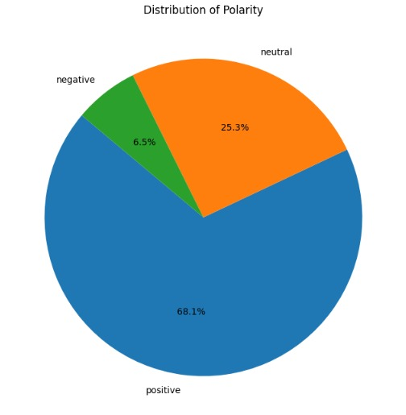

# Analisis Sentimen Ulasan Aplikasi Shopee

Proyek ini bertujuan untuk mengkaji sentimen masyarakat terhadap aplikasi Shopee, salah satu e-commerce terbesar di Indonesia, dengan menganalisis ulasan pengguna yang tersedia di Google Play Store. Proyek ini dibuat oleh **Kelompok 6** dalam rangka tugas Data Mining.

---

## Visualisasi Data

Beberapa visualisasi dilakukan dalam proyek ini:

### Distribusi Sentimen
Grafik yang menunjukkan jumlah ulasan untuk setiap kategori sentimen (positif, negatif, netral).

### Word Cloud Sentimen Positif
Menampilkan kata-kata yang sering muncul dalam ulasan positif pengguna.

### Word Cloud Sentimen Negatif
Menampilkan kata-kata dominan dari ulasan negatif pengguna.

### Word Cloud Sentimen Netral
Menampilkan kata-kata yang sering muncul dalam ulasan netral pengguna.

---

## Evaluasi Model

Evaluasi dilakukan terhadap tiga model deep learning yaitu LSTM, CNN, dan GRU, berdasarkan akurasi saat pelatihan (training) dan pengujian (testing).

- Model GRU memiliki akurasi pelatihan dan pengujian tertinggi dibandingkan model lain.
- Perbedaan akurasi antara data pelatihan dan pengujian relatif kecil, yang menunjukkan bahwa tidak terjadi overfitting yang signifikan.
- Model CNN meskipun memiliki akurasi training paling rendah, namun akurasi testing-nya sedikit lebih tinggi dari LSTM.

---

## Kontributor

Proyek ini dikerjakan oleh **Kelompok 6** dalam rangka penyelesaian tugas data mining:

- JERRIAN (G1A021002)
- ATTIYA DIANTI FADLI (G1A022002)
- TIESYA ANDRIANI R (G1A022014)
- IMELDA CYNTIA (G1A022022)
- REKSI HENDRA P (G1A022032)
